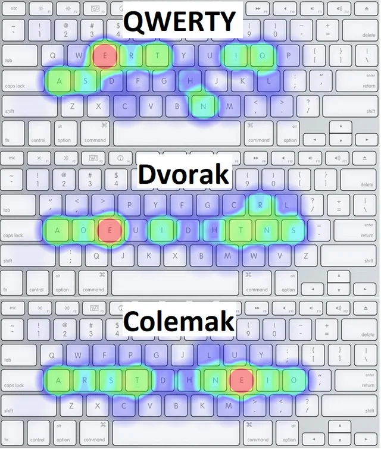
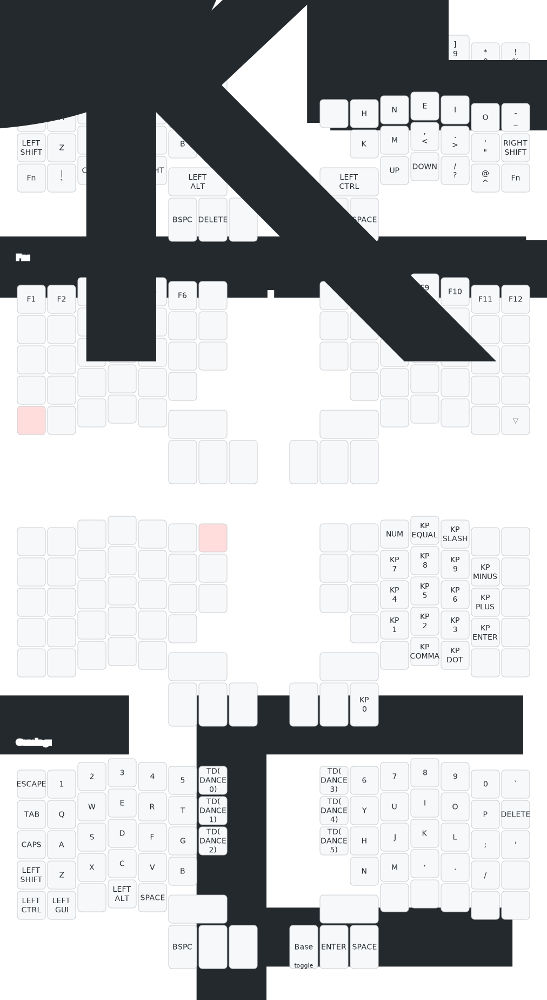

# RSI Antidote

## Motivation
I used to type on a macbook keyboard everyday and started to feel some pain my forearms, probably RSI (Repetitive Strain Injury).
Something needed to change, so I did some research and came to the conclusion that I wasn't alone. Phew.
A lot of people recommended a split keyboard and a different keyboard layout. That's when I switched to colemak.

## Why Colemak and not Dvorak
The reason for switching to a keyboard layout like colemak, is because all of the most used keys are placed on the home row.
Dvorak is also pretty good. But my brain saw one missing home row key and instantly went: nope.

## Split keyboard
Initially I wanted to go for the Kinesis Advantage360 Professional, but I found it a bit too expensive for my first split keyboard.
So I went for the ZSA moonlander, but my next keyboard will definitely be the Kinesis.

## Symbol placement
The default symbol layout annoyed me, so I rearranged them.

## Preview
ZSA Moonlander

